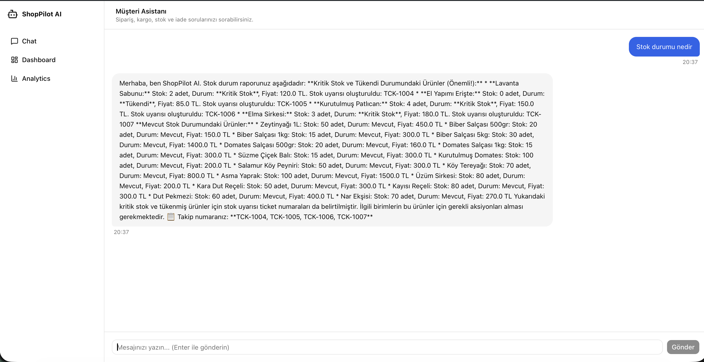
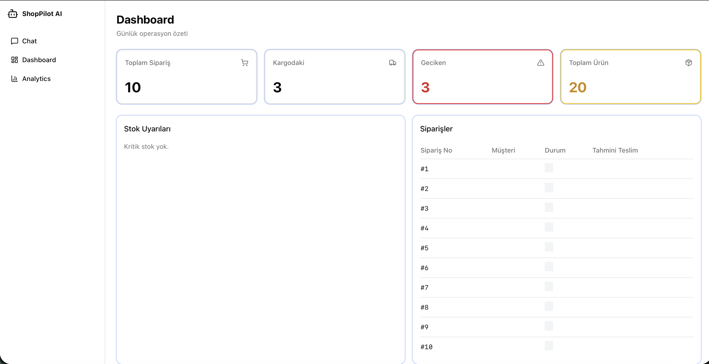
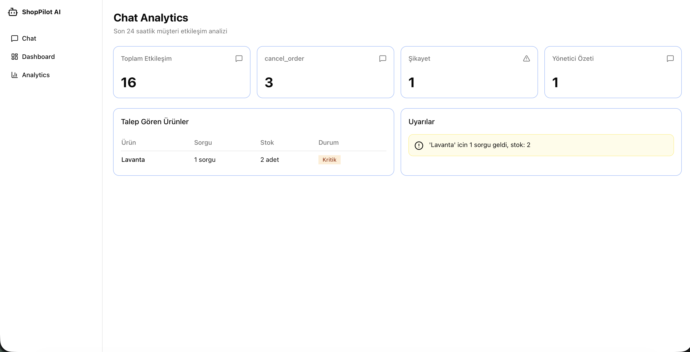
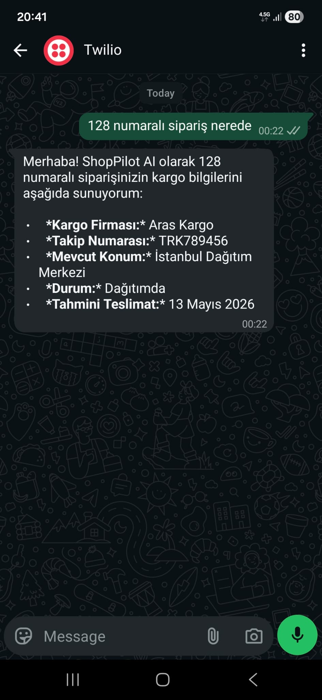

# ShopPilot AI - KOBİ ve Kooperatifler İçin Müşteri İletişimi Otomasyonu

ShopPilot AI, KOBİ ve kooperatiflerin sipariş, kargo, stok ve politika sorularını doğal dilde yönetmek için geliştirilmiş çoklu-agent tabanlı bir hackathon prototipidir.

## Hackathon Problem Tanımı
Küçük ve orta ölçekli işletmelerde müşteri iletişimi genellikle manuel yürütülür:
- "Siparişim nerede?"
- "Bu ürün stokta var mı?"
- "İade koşulları nedir?"

Bu süreç operasyonel zaman kaybı, insan hatası ve tutarsız müşteri deneyimi oluşturur.

## Çözüm Özeti
ShopPilot AI, gelen mesajı anlayıp uygun uzman agent'a yönlendirir, veritabanı ve politika dokümanından bilgi çeker, tek ve tutarlı bir yanıt üretir.

- Agent tabanlı mimari (Supervisor + Specialist Agents + Synthesizer)
- Doğal dil anlama/üretme (Gemini)
- Veri ile etkileşim (sipariş/kargo/stok)
- RAG benzeri politika arama (embedding + retrieval)
- Çoklu kanal uyarlanabilirliği (web chat + WhatsApp entegrasyonuna uygun yapı)

## Neden Hackathon'a Uygun?
- Gerçek bir operasyonel probleme odaklıdır.
- Yapay zekâyı sadece sohbet değil, karar/veri akışı içinde kullanır.
- Uçtan uca çalışan MVP sunar (chat + dashboard + analytics + backend orchestration).
- Hızla demo yapılabilir ve etki net şekilde gösterilebilir.

## Sistem Mimarisi

```text
Frontend (Next.js)
  -> /api/chat (FastAPI)
    -> Supervisor Agent (intent routing)
      -> Order Agent -----> order_tools (DB)
      -> Shipment Agent --> shipment_tools (DB)
      -> Stock Agent ----> stock_tools (DB)
      -> Policy Agent ---> rag_tools -> policy.md (RAG)
      -> Complaint Agent (escalation)
      -> Manager Agent --> dashboard_tools (DB)
    -> Synthesizer Agent (tek final cevap)
  <- Chat response
```

## Bileşenler
- `frontend/`: Next.js tabanlı chat, dashboard ve analytics arayüzü
- `backend/app/api`: REST endpoint'leri
- `backend/app/agents`: LangGraph ile agent orkestrasyonu
- `backend/app/tools`: Agent'ların veri/servis araçları
- `backend/app/services`: Gemini, RAG, analytics servisleri
- `backend/app/models`: SQLAlchemy veri modelleri
- `docs/policy.md`: İade/hasar/garanti/kargo politikaları

## Agent Akışı
1. Kullanıcı mesajı `/api/chat` endpoint'ine gelir.
2. `supervisor` intent'leri çıkarır (`order_status`, `shipment_status`, `stock_query`, `policy_question`, `complaint`, `manager_summary`).
3. Uygun specialist agent(lar) ilgili tool'u çağırır.
4. Birden fazla sonuç varsa `synthesizer` tek ve akıcı cevapta birleştirir.
5. Sonuç `ChatLog` tablosuna intent ve çıkarılan parametrelerle kaydedilir.

## Yapay Zekâ Yaklaşımı

### 1) Intent Routing
- Model, mesajı sınıflandırır ve JSON formatında intent + parametre çıkarır.
- Örnek parametreler: `order_number`, `product_name`.

### 2) Specialist Agent Yanıt Üretimi
- Her agent alan-özel bir system prompt ile çalışır.
- Yanıtlar sadece araçlardan (tool) gelen veriye dayandırılır.

### 3) RAG Benzeri Politika Cevaplama
- `docs/policy.md` chunk'lanır ve embedding'lenir.
- Politika sorularında benzer parçalar retrieval ile çekilir.

### 4) Çoklu Cevap Sentezi
- Birden fazla agent sonucu tek bir müşteri yanıtına dönüştürülür.

## Veri Modeli (Özet)
- `Product`: ürün, stok, fiyat
- `Order`: sipariş no, durum, tahmini teslim, tutar
- `Shipment`: kargo firması, takip no, konum, durum
- `ChatLog`: kullanıcı mesajı, AI yanıtı, intent, ürün/sipariş parametreleri

## Kurulum ve Çalıştırma

## Gereksinimler
- Python 3.11+
- Node.js 18+
- Gemini API key

### 1) Backend
```bash
cd backend
python -m venv .venv
source .venv/bin/activate
pip install -r requirements.txt
cp ../.env.example .env
# .env içine GEMINI_API_KEY ekleyin
uvicorn app.main:app --reload --port 8000
```

### 2) Frontend
```bash
cd frontend
npm install
npm run dev
```

Frontend: `http://localhost:3000`  
Backend: `http://localhost:8000`

## Ortam Değişkenleri
`.env` (backend için):
- `GEMINI_API_KEY`
- `DATABASE_URL` (varsayılan: `sqlite:///./shoppilot.db`)
- `CORS_ORIGINS` (varsayılan: `http://localhost:3000`)

## API Endpoint'leri (Özet)
- `POST /api/chat` -> Agent orkestrasyonlu sohbet
- `GET /api/orders` -> Sipariş listesi
- `GET /api/orders/by-number/{order_number}` -> Sipariş detayı
- `GET /api/shipments/by-order/{order_id}` -> Kargo bilgisi
- `GET /api/stock` -> Stok listesi
- `GET /api/stock/search?q=...` -> Ürün arama
- `GET /api/dashboard/summary` -> Yönetici özet metrikleri
- `GET /api/analytics/summary?hours=24` -> Etkileşim analitiği

## Demo Senaryosu
Aşağıdaki sorularla kısa demo yapılabilir:

1. `128 numaralı siparişim nerede?`
Beklenen: Sipariş/kargo durumu + tahmini teslim.

2. `Lavanta sabunu stokta var mı?`
Beklenen: Stok adedi, durum (kritik/mevcut/tükendi), fiyat.

3. `İade politikanız nedir?`
Beklenen: Politika dokümanından retrieval tabanlı yanıt.

4. `Bugünkü yönetici özeti ver`
Beklenen: Toplam sipariş, geciken, kritik stok özetleri.

5. `Ürün hasarlı geldi`
Beklenen: Şikayet karşılama + yöneticiye escalation bilgisi.

## Ekran Görüntüleri
Not: Aşağıdaki yollar `docs/screenshots/` altında görselleri bekler.

### Chat - Stok Sorgusu


### Dashboard - Operasyon Özeti


### Analytics - Talep ve Uyarılar


### WhatsApp/Twilio Entegrasyon Akışı


## Hackathon Kriterlerine Hizalama
- Yapay zekâ kullanımı: intent routing + response generation
- Agent mimarisi: supervisor + specialist yapısı
- Veri ile çalışma: sipariş, kargo, stok, chat log
- Aksiyon alabilen sistem: şikayet escalation ve yönetici akışı
- Otomasyon seviyesi: uçtan uca otomatik mesaj işleme
- Kullanıcı deneyimi: basit ve akıcı chat arayüzü

## Sınırlılıklar (MVP)
- WhatsApp/e-posta gibi dış kanal entegrasyonlarının prod seviyesi güvenlik/izleme katmanları henüz MVP kapsamı dışındadır.
- Gerçek operasyonel aksiyonlar (iptal, ticket lifecycle) geliştirilebilir.
- Test kapsamı ve gözlemlenebilirlik (monitoring) artırılabilir.

## Türkçe Karakter Desteği
Bu repo UTF-8 ile kullanılmalıdır.

- Dosyaları UTF-8 olarak kaydedin.
- Terminal/IDE encoding ayarını UTF-8 yapın.
- Veritabanında Türkçe karakterli veri için UTF-8 uyumlu bağlantı kullanın.

## Güvenlik Notu
Gerçek API anahtarları repoya commit edilmemelidir. Yalnızca `.env.example` takip edilmeli, gerçek anahtarlar ortam değişkeni olarak yönetilmelidir.
